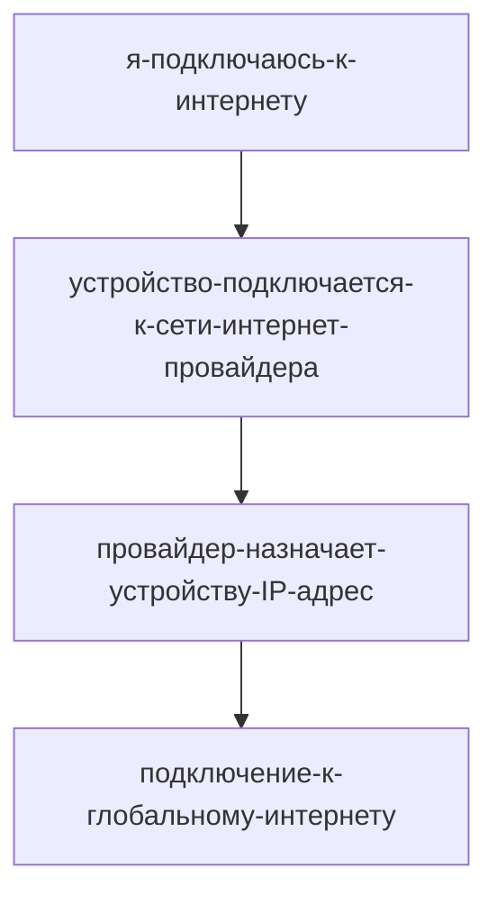

1. __Размер экрана.__

	- Адаптация дизайна и содержания сайта, чтобы лучше смотрелись на устройстве, а также оптимизация загрузки изображений и видео, загрузка сайта быстрее
	- Анализировать статистику => улучшение работы сайта
	- Показ рекламы с определенным расширением экрана

2. __Технические характеристики устройства__
		
	Браузер собирает данные об устройстве, потом обменивается этими данными с сервером (при загрузке сайта) — так формируется наш цифровой отпечаток.
		Цифровой отпечаток состоит из различных параметров, например:
			- операционная система,
			- процессор,
			- видеокарта,
			- разрешение экрана,
			- системные шрифты,
			- настройки времени и геолокации. 
		Все это образует уникальный идентификатор, по которому можно распознать отдельных пользователей.
		
3. __Геолокация__
	
	Местоположение можно определить двумя способами: IP-адрес и по данным браузера.
	
	Зачем это нужно:
		- улучшение опыта использования и персонализация контента.
		- проверка подозрительной активности. 
		- для показа подходящие объявления.

	
4. __Информация о браузере__
		Когда при загрузке сайта браузер обменивается данными с сервером, он передаёт и информацию о себе.
	
	**Зачем это нужно:**
		- Какие-то функции, стили или код могут работать по-разному в разных браузерах. Зная тип браузера, сайт оптимизирут контент под него или его конкретную версию.
		- Некоторые функции, технологии или стандарты доступны только в определённых браузерах. Такой подход помогает избежать проблем с отображением контента или предупредить нас, что какие-то свойства сайта не поддерживаются.
		- Разные браузеры могут иметь известные уязвимости, которые ещё не закрыли. Знание типа браузера может помочь обнаружить и предотвратить попытки взлома или злоумышленного поведения на сайте.

5. Куки

	Когда мы заходим на какой-то сайт, сервер отправляет на наш компьютер куки — небольшие текстовые файлы с порцией данных, которые могут быть использованы для идентификации посетителя, сохранения его предпочтений или отслеживания его поведения на сайте.
	
	**Зачем это нужно:**
	- Отслеживание состояния нашего сеанса.
	- Персонализация и запоминание предпочтений.
	- Аналитика и отслеживание наших действий.
	- Реклама и маркетинг.

6.  Действия на странице
		
	Сайты могут определять наши действия на страницах с помощью различных методов: 
		- событий JavaScript - отслеживаются нажатия кнопок, отправки форм, прокрутка страниц и так далее
		-  аналитических инструментов - код, который встраивается на страницу и собирает данные о наших посещениях, действиях и поведении
		- серверных логов - это журналы событий
		- куки и сеансы - содержать информацию о наших предыдущих действиях на сайте или сохранять идентификатор сеанса, который связывает все наши действия на сайте в пределах одного визита.
		- трекеров и пиксели - это специальные элементы, которые используются, чтобы отслеживать наши взаимодействия с рекламными объявлениями или сообщениями.
	
	Отслеживание послезно для нас тем, что контент персонализируется и оптимизируется для нас. 

	[Как устроены рекомендательные системы](https://thecode.media/recommender/)
	
	Улучшение для сайтов
	- Улучшаются конверсии и продажи. 
	- Данные о действиях на сайте позволяют измерять эффективность рекламных кампаний, оптимизировать производительность страниц, выявлять проблемы или узкие места сайта и принимать меры по его улучшению.

7. Источники трафика

	Сайты могут определять источники трафика различными методами:
	
	- URL-параметры, такие как UTM-метки. Например, если мы переходим на сайт из рекламы, адрес сайта может содержать параметр, указывающий на рекламный источник.
	- HTTP-заголовки. При каждом нашем запросе к сайту наш браузер отправляет HTTP-заголовки с информацией о реферере — странице или источнике, с которого мы перешли на сайт.
	- Куки могут содержать информацию об источнике трафика, если они установлены на том сайте, с которого мы перешли на новый.
	- Инструменты аналитики, такие как Яндекс Метрика и Google Analytics, могут использоваться, чтобы отслеживать трафик и анализировать источники посещений.
	
	Данные об источниках трафика нужны сайтам для аналитики и оптимизации рекламных кампаний. 